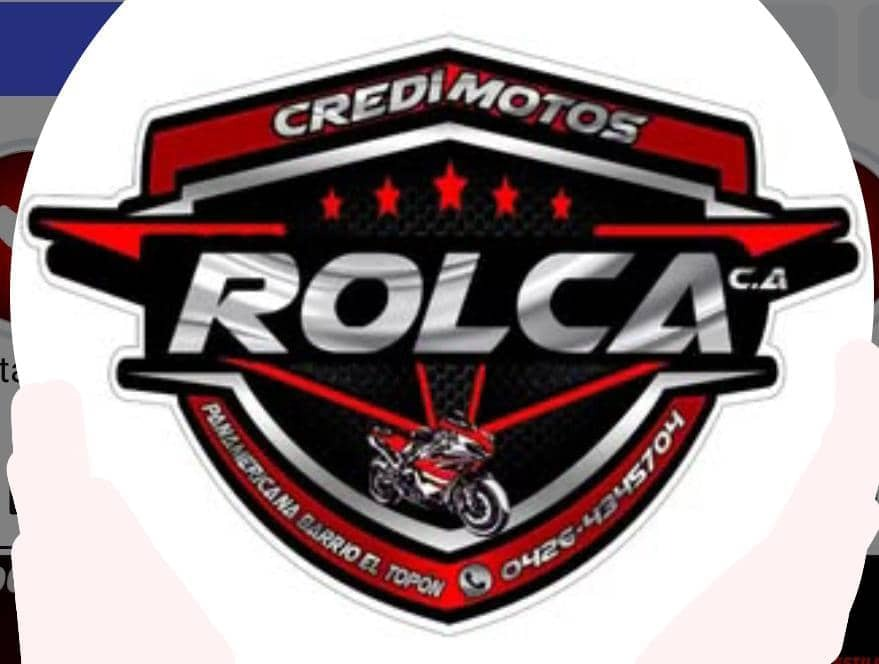

# 🏍️ CrediMotos ROLCA C.A.

Sistema de Gestión de Créditos para Motocicletas



## 📋 Descripción

Sistema web completo para la gestión de créditos de motocicletas de **CrediMotos ROLCA C.A.**, ubicado en Panamericana, Barrio El Topón. 

### Funcionalidades:
- 🏠 **Landing Page** - Página pública con catálogo y simulador de crédito
- 🔐 **Sistema de Login** - Autenticación segura
- 📊 **Dashboard** - Panel administrativo con KPIs y gráficos
- 👥 **Gestión de Clientes** - CRUD completo de clientes con documentos
- 🏍️ **Inventario** - Control de motocicletas disponibles
- 💳 **Gestión de Créditos** - Creación de créditos con tabla de amortización
- 💰 **Control de Pagos** - Registro de pagos multi-moneda (USD, Bs, Zelle, Binance, Pago Móvil)

## 🚀 Stack Tecnológico

- **Framework:** Next.js 14 (App Router, TypeScript)
- **Estilos:** Tailwind CSS
- **Componentes:** shadcn/ui + Radix UI
- **Base de Datos:** Supabase (PostgreSQL)
- **Autenticación:** Supabase Auth
- **Gráficos:** Recharts
- **Deploy:** Vercel

## 📦 Instalación

```bash
# Clonar repositorio
git clone https://github.com/TU_USUARIO/credimotos-rolca.git

# Instalar dependencias
npm install

# Configurar variables de entorno
cp .env.local.example .env.local
# Editar .env.local con tus credenciales de Supabase

# Ejecutar en desarrollo
npm run dev
```

## 🔐 Acceso

Los usuarios del sistema se gestionan de forma segura mediante Supabase Auth.

## 📞 Contacto

- **Teléfono:** 0426-4345704
- **Ubicación:** Panamericana, Barrio El Topón
- **WhatsApp:** [Contactar](https://wa.me/584264345704)

## 📄 Licencia

© 2024 CrediMotos ROLCA C.A. Todos los derechos reservados.
